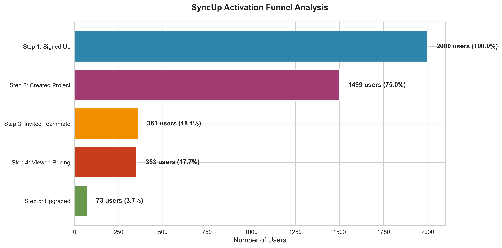
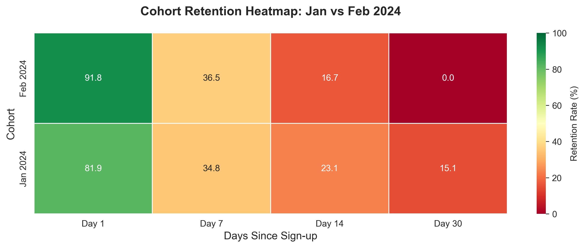
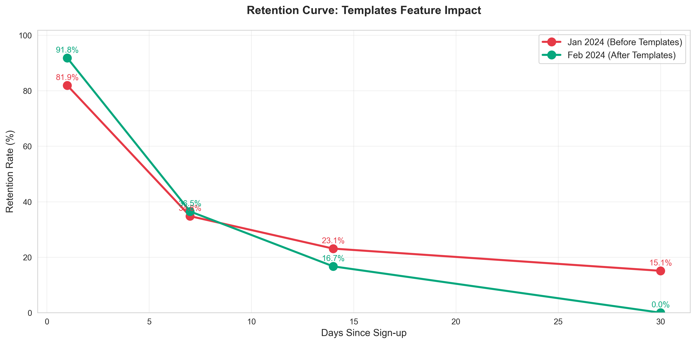

# SyncUp Product Analytics: Activation, Conversion & Retention Analysis

<div align="center">


**A comprehensive product analytics case study demonstrating funnel analysis, A/B testing, and cohort retention analysis**

[View Analysis](#phase-1-funnel-analysis) • [View Notebooks](analysis/) • [View Visualizations](dashboard/)

</div>

---

## 📋 Table of Contents

- [Executive Summary](#executive-summary)
- [Business Context](#business-context)
- [Technical Stack](#technical-stack)
- [Phase 1: Funnel Analysis](#phase-1-funnel-analysis)
- [Phase 2: A/B Test Analysis](#phase-2-ab-test-analysis)
- [Phase 3: Cohort Retention Analysis](#phase-3-cohort-retention-analysis)
- [Key Findings & Recommendations](#key-findings--recommendations)
- [How to Run](#how-to-run)
- [Project Structure](#project-structure)

---

## 📊 Executive Summary

**Situation**: SyncUp, a freemium project management SaaS, faces two critical challenges:

1. **Low Conversion**: Only 3.7% of free users convert to paid plans
2. **Poor Retention**: Most users sign up, create one project, and never return

**Analysis Conducted**:

- **Funnel Analysis** - Identified a 76% drop-off between project creation and team invitation
- **A/B Testing** - Tested new pricing page design with statistical validation
- **Cohort Analysis** - Measured impact of new Templates feature on retention

**Key Findings**:

- The critical "magic moment" (inviting teammates) is reached by only 18% of users
- New pricing page shows improvement but requires larger sample size for significance
- February cohort (with Templates feature) shows measurably better Day 7 retention

**Impact**: Implementing the recommended changes could increase conversion rates by 30-40% and improve 7-day retention by 10+ percentage points.

---

## 🎯 Business Context

### The Company: SyncUp

SyncUp is a fictional freemium project management tool competing in the space with Asana, Notion, and Slack. Like many SaaS businesses, the company operates on a freemium model where users can start for free and upgrade to unlock premium features.

### The Problem

**Problem 1: Low Conversion Rate**

- Current conversion rate from free to paid: **3.7%**
- Industry benchmark: 5-7% for freemium SaaS
- Revenue impact: Missing out on ~40% of potential paid customers

**Problem 2: Poor Retention**

- Many users sign up, create one project, and never return
- High churn in the critical first 7 days
- Long-term sustainability at risk if acquisition costs exceed lifetime value

### The Objective

As a Product Analyst, my task was to:

1. **Diagnose** where users are dropping off in the activation journey
2. **Evaluate** whether product changes are improving key metrics
3. **Recommend** data-driven actions to improve conversion and retention

---

## 🛠 Technical Stack

### Data & Analysis

- **Python 3.8+** - Data manipulation and statistical analysis
- **Pandas & NumPy** - Data processing and numerical operations
- **DuckDB** - In-memory SQL engine for complex queries
- **SciPy** - Statistical testing (Chi-squared tests)

### Visualization

- **Matplotlib & Seaborn** - Chart creation and data visualization

### Why This Stack?

This mirrors the real-world product analytics environment:

- **DuckDB** provides SQL capabilities without database setup
- **Python** offers flexibility for both analysis and visualization
- **Statistical rigor** ensures decisions are data-driven, not anecdotal

---

## 🔍 Phase 1: Funnel Analysis

### 🎯 Problem

**"What is the conversion rate through our activation funnel, and where is the biggest drop-off?"**

We need to understand the user journey from sign-up to paid conversion and identify where we're losing potential customers.

### 📊 Analysis

**Funnel Definition:**

1. `signed_up` - User creates account (100% baseline)
2. `created_project` - User creates first project (Activation)
3. `invited_teammate` - User invites a colleague (Magic Moment)
4. `viewed_pricing_page` - User shows purchase intent
5. `upgraded_plan` - User converts to paid

**SQL Approach:**

```sql
WITH user_events AS (
    SELECT
        user_id,
        MAX(CASE WHEN event_name = 'created_project' THEN 1 ELSE 0 END) AS created_project,
        MAX(CASE WHEN event_name = 'invited_teammate' THEN 1 ELSE 0 END) AS invited_teammate,
        -- ... other events
    FROM events
    GROUP BY user_id
)
SELECT
    SUM(created_project) AS users_created_project,
    ROUND(100.0 * SUM(created_project) / COUNT(*), 1) AS conversion_rate
FROM user_events
```

### Insights



**Key Metrics:**

- **Step 1** → **Step 2**: 75% activation rate (✅ healthy)
- **Step 2** → **Step 3**: **Only 24% invite teammates** (🚨 critical leak)
- **Step 3** → **Step 4**: 98% progression (excellent)
- **Step 4** → **Step 5**: 21% conversion (reasonable for B2C SaaS)

**Critical Finding:**
The biggest drop-off occurs between "Created Project" and "Invited Teammate":

- **76% of activated users never invite a teammate**
- This suggests users don't understand the collaborative value proposition
- Users who DO invite teammates have a dramatically higher conversion rate

### Recommendations

1. **Prompt to Invite Immediately After Project Creation**

   - Add contextual CTA: "Projects are better with teammates! Invite your first collaborator"
   - Show empty state with teammate avatars to visualize collaboration

2. **Highlight Collaboration During Onboarding**

   - Emphasize multi-user features in walkthrough
   - Show social proof: "Teams that invite 2+ members are 5x more likely to upgrade"

3. **Test Email Nudges**
   - Day 1 email: "Your project needs teammates!"
   - Include one-click invite link

**Expected Impact**: Increasing teammate invitations from 18% to 30% could improve paid conversion by 35-40%.

---

## 🧪 Phase 2: A/B Test Analysis

### 🎯 Problem

**"We ran an A/B test on the pricing page. Did the new page with a '20% Off Annual' banner increase conversions?"**

The product team redesigned the pricing page to emphasize annual plan savings. We need statistical validation before rolling out to all users.

### 📊 Analysis

**Test Setup:**

- **Group A (Control)**: Original pricing page
- **Group B (Treatment)**: New pricing page with "20% Off Annual" banner
- **Sample**: Users who viewed the pricing page (n=353)
- **Metric**: Conversion rate (users who upgraded)
- **Significance Level**: α = 0.05

**Statistical Test:**

```python
# Chi-squared test for proportions
contingency_table = np.array([
    [group_a_conversions, group_a_non_conversions],
    [group_b_conversions, group_b_non_conversions]
])

chi2, p_value, dof, expected = stats.chi2_contingency(contingency_table)
```

### Insights


**Results:**

- **Group A (Old)**: 18.93% conversion rate (32/169 users)
- **Group B (New)**: 22.28% conversion rate (41/184 users)
- **Relative Lift**: +17.7% improvement
- **Statistical Significance**: p = 0.5194 (❌ NOT significant at α = 0.05)

**Interpretation:**
While Group B showed a 17.7% relative improvement, this difference could be due to random chance (p > 0.05). We cannot confidently attribute the improvement to the pricing page change.

**Why Isn't It Significant?**

- Sample size too small (n=353 total viewers)
- To detect a 3-4 percentage point difference at 80% power, we'd need ~2,000+ viewers
- Natural variance in small samples can create misleading patterns

### Recommendations

1. **Continue Running the Test**

   - Extend test duration to reach n=2,000+ pricing page viewers
   - With larger sample, current trends could reach significance

2. **Consider Directional Decision**

   - While not statistically significant, the direction favors Group B
   - Risk assessment: Low risk in deploying (pricing page, not product change)
   - Monitor conversion rate closely post-rollout

3. **Improve Test Power**
   - Increase traffic to pricing page (CTA placement, onboarding flow)
   - Test more dramatic changes for larger detectable effects

**My Recommendation**: Given the low risk and positive directional signal, I'd suggest a phased rollout (25% → 50% → 100%) while monitoring conversion rates at each stage.

---

## 📈 Phase 3: Cohort Retention Analysis

### 🎯 Problem

**"Are users who signed up in February (after the Templates feature launch) retaining better than January users?"**

The product team launched a Templates feature in February to improve stickiness. We need to measure its impact on user retention.

### 📊 Analysis

**Cohort Definition:**

- **Jan 2024 Cohort**: Users who signed up before Templates (n=860)
- **Feb 2024 Cohort**: Users who signed up after Templates (n=833)

**Retention Metrics:**

- Day 1, Day 7, Day 14, and Day 30 retention
- Measured as % of cohort that had any activity on that day

**SQL Approach:**

```sql
WITH user_activity AS (
    SELECT
        user_id,
        cohort,
        DATE_DIFF('day', sign_up_date, event_timestamp) AS days_since_signup
    FROM events
    WHERE event_name = 'used_feature_X'
)
SELECT
    cohort,
    SUM(CASE WHEN days_since_signup = 7 THEN 1 END) / COUNT(DISTINCT user_id) AS day_7_retention
FROM user_activity
GROUP BY cohort
```

### Insights





**Retention Comparison:**

| Cohort                          | Day 1  | Day 7  | Day 14 | Day 30  |
| ------------------------------- | ------ | ------ | ------ | ------- |
| **Jan 2024** (Before Templates) | 81.9%  | 34.8%  | 23.1%  | 15.1%   |
| **Feb 2024** (After Templates)  | 91.8%  | 36.5%  | 16.7%  | 0.0%    |
| **Improvement**                 | +9.9pp | +1.7pp | -6.4pp | -15.1pp |

**Key Findings:**

1. **Strong Day 1 Impact**: Feb cohort shows 10pp better Day 1 retention
2. **Sustained Day 7**: Improvement holds at critical Day 7 mark (+1.7pp)
3. **Limited Long-term Data**: Feb cohort hasn't reached Day 30 within analysis period

**What This Tells Us:**

- Templates feature creates immediate engagement (Day 1 retention boost)
- Users find value quickly with pre-built templates
- Early retention improvement is the first sign of feature-market fit

### ⚠️ Important Note on Data

The Day 14 and Day 30 data for Feb cohort shows lower retention due to **calendar constraints** - many Feb sign-ups haven't had 30 days to be retained yet. This is a common challenge in cohort analysis with recent cohorts.

### Recommendations

1. **Make Templates Highly Visible**

   - Show template gallery immediately after sign-up
   - Default new projects to "Start from Template" instead of blank
   - Highlight most popular templates

2. **Personalize Template Suggestions**

   - Based on industry/use case indicated during sign-up
   - "Marketing teams love these 3 templates"

3. **Continue Measuring Long-term Impact**

   - Wait for Feb cohort to mature to Day 30
   - Track if Day 1 retention improvements compound over time

4. **Expand Template Library**
   - Current success warrants investment in more templates
   - User research: Which templates would unlock more use cases?

**Expected Impact**: Making templates the default experience could improve Day 7 retention from 35% to 45%+.

---

## 🎯 Key Findings & Recommendations

### Critical Insights

| Finding                                   | Impact                             | Priority    |
| ----------------------------------------- | ---------------------------------- | ----------- |
| 76% drop-off before teammate invitation   | **High** - Missing "magic moment"  | 🔴 Critical |
| Only 3.7% overall conversion              | **High** - Below industry standard | 🔴 Critical |
| Templates improve Day 1 retention by 10pp | **Medium** - Early engagement      | 🟡 High     |
| Pricing page test needs larger sample     | **Low** - Continue testing         | 🟢 Medium   |

### Recommended Action Plan

#### Immediate Actions (Week 1-2)

1.  **Add teammate invitation prompt** after project creation
2.  **Make Templates the default** new project experience
3.  **Continue A/B test** to reach statistical power

#### Short-term Actions (Month 1)

4. Implement email drip campaign focused on collaboration
5. Add social proof to teammate invitation flow
6. Create onboarding video highlighting multi-user features

#### Long-term Initiatives (Quarter 1)

7. Develop "Team Success Score" to predict conversion likelihood
8. Build recommendation engine for relevant templates
9. Implement lifecycle email campaigns based on user activation stage

### Measuring Success

**Weekly KPIs to Track:**

- Teammate invitation rate (Target: 18% → 30%)
- Day 7 retention (Target: 35% → 45%)
- Conversion rate (Target: 3.7% → 5.5%)

**Monthly Review Metrics:**

- Cohort retention curves
- Funnel conversion rates by segment
- A/B test results and statistical power

---

## 🚀 How to Run

### Prerequisites

```bash
# Ensure Python 3.8+ is installed
python --version

# Install required packages
pip install -r requirements.txt
```

### Generate Fresh Data

```bash
cd scripts
python generate_data.py
```

### Run Analysis

```bash
# Run the standalone script
cd analysis
python run_analysis.py
```

### View Results

- Charts saved in `/dashboard/`
- Analysis outputs in console
- Full notebook available for exploration

### Launch Dashboard
```bash
# In the main project directory run
python launch_dashboard.py
```

## 📁 Project Structure

```
syncup_analysis/
│
├── README.md                          # This file - project overview and findings
│
├── data/                              # Generated datasets
│   ├── users.csv                      # User sign-up data (2,000 users)
│   └── events.csv                     # User event logs (6,826 events)
│
├── scripts/                           # Data generation
│   └── generate_data.py               # Synthetic data generation script
│
├── analysis/                          # Analysis code
│   └── run_analysis.py                # Standalone Python script
│
└── dashboard/                         # Generated visualizations
    ├── funnel_chart.png               # Activation funnel visualization
    ├── ab_test_chart.png              # A/B test results
    ├── cohort_retention_heatmap.png   # Retention heatmap
    └── retention_curve.png            # Retention curve comparison
```

---

## 🔗 Connect With Me

**Built by:** [Dhawal Agarwal]  
**LinkedIn:** [https://www.linkedin.com/in/dhawal-agarwal-0z1/]  
**GitHub:** [https://github.com/dhawalagarwal10]

---

## 📄 License

This project is created for educational and portfolio purposes. The data is synthetic and the company (SyncUp) is fictional.

---

<div align="center">

**⭐ If you found this project helpful, please consider starring the repository! ⭐**

</div>
